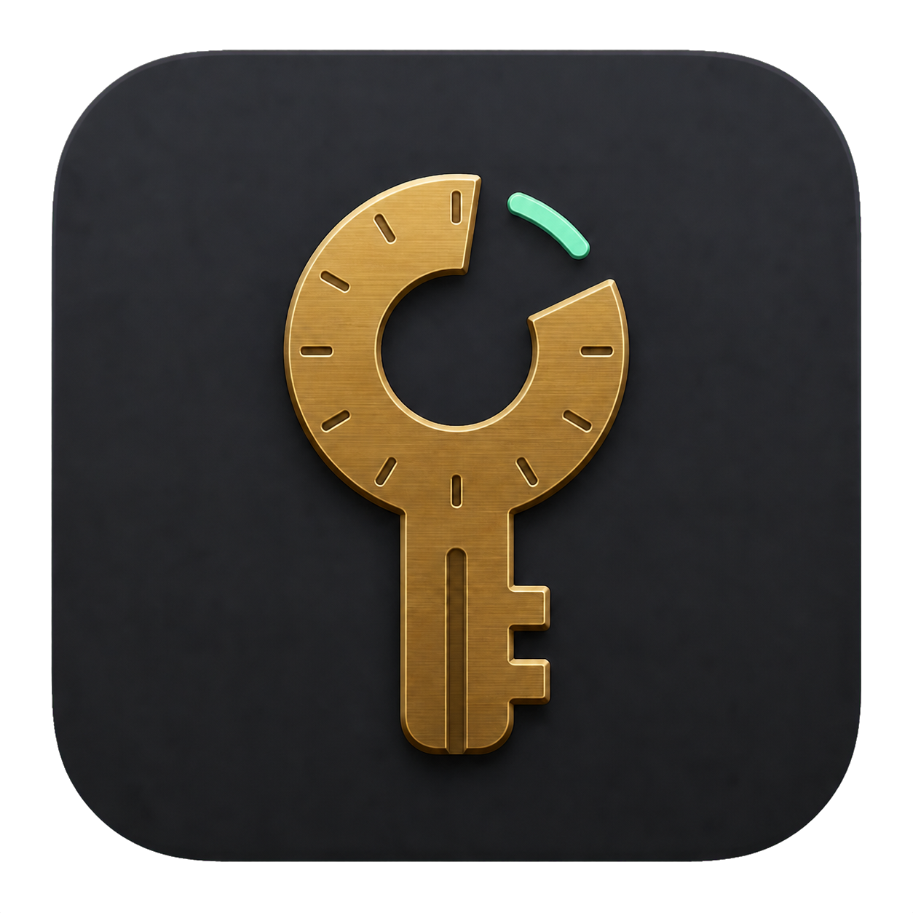

# key-session

<div align="center">
  
</div>

[](https://github.com/theronburger/key-session/actions/workflows/ci.yml)
[](https://github.com/theronburger/key-session/actions/workflows/codeql.yml)
[](https://github.com/theronburger/key-session/actions/workflows/release.yml)

`key-session` gives local tools and coding agents time-limited, user-approved access to secrets stored in macOS Keychain.

Every agent task gets an ephemeral consumer capability. Its leases are isolated from other Codex or Claude tasks, explain their purpose, expire automatically, and require an unmistakable native approval flow. Secrets are never placed in process arguments or written to disk.

## Requirements

- macOS 14 or newer
- Apple Silicon or Intel Mac

## Install

Download the universal, Developer ID-signed, notarized archive from [GitHub Releases](https://github.com/theronburger/key-session/releases/latest), then install the app:

```bash
ditto -x -k key-session_*_macos_universal.zip .
mv "Key Session.app" "$HOME/Applications/"
ln -s "$HOME/Applications/Key Session.app/Contents/MacOS/key-session" "$HOME/.local/bin/key-session"
open "$HOME/Applications/Key Session.app"
key-session doctor
```

The native menu-bar app installs and supervises the per-user access daemon. Its command center surfaces consumer sessions and their leases, gated profile management, a metadata-only activity journal, and Connection Doctor. Quitting the frontend does not revoke consumers or stop the daemon.

To build from source instead:

```bash
scripts/build-app.sh "$HOME/Applications/Key Session.app"
ln -s "$HOME/Applications/Key Session.app/Contents/MacOS/key-session" "$HOME/.local/bin/key-session"
open "$HOME/Applications/Key Session.app"
key-session doctor
```

## Use

Store a secret once under a named profile. The terminal prompt is hidden:

```bash
key-session setup production-read-only --env MONGODB_URI --duration 1h
```

The first grant for an agent task lazily creates a consumer capability and approves a lease through one native macOS authentication sheet. The sheet carries the consumer label, profile, duration, and reason. Consumer sessions default to 24 hours and may be created for one hour through seven days:

```bash
key-session grant production-read-only \
  --consumer "Codex: investigate-api-errors" \
  --consumer-duration 48h \
  --reason "Read request logs for incident INC-123"
```

The response returns a `ksc_…` consumer capability and a `lease_…` ID. Retain the capability only in that agent task. Do not put it in MCP configuration, files, logs, or source control. Supply it through `KEY_SESSION_CONSUMER_TOKEN`; the non-secret lease ID selects the exact approval:

```bash
KEY_SESSION_CONSUMER_TOKEN='<consumer capability>' \
  key-session exec --lease lease_... -- api-client fetch /resource
```

Inspect only that consumer, revoke one lease, or end the complete consumer session:

```bash
KEY_SESSION_CONSUMER_TOKEN='<consumer capability>' key-session status
KEY_SESSION_CONSUMER_TOKEN='<consumer capability>' key-session revoke --lease lease_...
KEY_SESSION_CONSUMER_TOKEN='<consumer capability>' key-session revoke
```

The consumer capability is an authorization boundary, not a secret value from Keychain. Losing it safely loses access to existing leases; creating a replacement consumer and lease requires another Touch ID approval. A daemon restart also invalidates every consumer and lease.

Check installation health, build provenance, and available updates:

```bash
key-session doctor
key-session version --json
key-session update
```

Run `key-session help` or `key-session <command> --help` for complete examples. Human-facing inspection commands support `--json` where automation benefits from it, and Cobra provides shell completion generation.

## MCP

`key-session mcp` exposes an agent-appropriate stdio MCP server. The first `request_key_session` call returns a consumer capability and lease ID. The task passes both to later status, execution, and revocation calls; the MCP configuration never contains a shared credential. Secret setup and deletion remain human-facing operations.

```json
{
  "mcpServers": {
    "key-session": {
      "command": "key-session",
      "args": ["mcp"]
    }
  }
}
```

## Agent skill

The repository includes a ready-to-install Codex skill that enforces one consumer per task, capability hygiene, exact-lease execution, and safe cleanup:

```bash
mkdir -p "$HOME/.codex/skills"
cp -R skills/using-keys "$HOME/.codex/skills/using-keys"
```

Invoke it explicitly with `$using-keys`, or let Codex load it automatically whenever a task mentions key-session, a key profile, or macOS Keychain access. The skill includes extra safeguards for database work and environment-variable mapping without exposing credentials.

## Architecture

The Go daemon is the sole owner of profile mutations, Keychain access, active secret memory, expiry, execution, and the local audit journal. The SwiftUI app, CLI, and MCP server are clients of the schema-v2 authenticated loopback API discovered through an owner-only runtime descriptor.

Consumer capabilities are random bearer values created with the first approved lease. The daemon stores only their SHA-256 hashes in memory. Each consumer owns an independent set of leases, and every agent-facing status, execution, and revocation call must present the capability plus, where applicable, an exact lease ID. A grant never replaces another consumer's access. Consumer capabilities default to 24 hours, are bounded from one hour to seven days, never persist across daemon restarts, and erase all owned secrets when they expire.

Lease and execution APIs never return secrets. Human profile management is an explicit exception: clicking a profile's pencil opens an editor containing metadata only. The secret stays in Keychain until the human clicks the eye, at which point LocalAuthentication requires Touch ID with no password fallback. After approval, a Keychain ACL restricted to the signed Key Session executable releases the value without another prompt. Only then does the daemon return that one profile's secret and a five-minute, single-use management capability to the native app. The app keeps the value only in transient view state and clears it when the editor closes. Save and delete require that capability.

## Updates

Interactive, non-secret commands check the official GitHub releases feed at most once every 24 hours. The request identifies the installed version in its user agent; no profile, consumer, or lease data is sent. Checks have a two-second timeout, failures stay silent, and the cache contains only the latest public version, release URL, and check time. Update checks never run for `grant`, `exec`, `setup`, daemon or MCP processes, JSON output, CI, or redirected output.

Set `KEY_SESSION_NO_UPDATE_CHECK=1` to disable automatic checks. `key-session update --force` always performs an explicit refresh. The application reports updates but deliberately does not replace its own security-sensitive executable.

## Security

The secret is encrypted in the macOS login Keychain at rest. Each grant requires Touch ID; its sheet displays the consumer, profile, duration, and reason and offers no password fallback. Consumer labels and reasons are display context; possession of the random consumer capability is the authorization boundary. During a lease the secret exists only in the memory of the per-user daemon and is never placed in process arguments or written to disk. Leased children receive a small allowlist of ordinary process variables plus the one approved profile variable—not the daemon's full launch environment. Exact secret values and URI passwords are redacted from captured child output as a last line of defense; encoded or transformed secrets may not be recognized, so callers must still avoid printing credentials.

Read the [security model](docs/SECURITY-MODEL.md) before deploying broadly. Report vulnerabilities privately according to [SECURITY.md](SECURITY.md).

## Development

```bash
make check
make app
make release-dry-run
```

CI tests the supported macOS floor and current macOS, runs race detection, linting, `govulncheck`, CodeQL, and a universal packaging dry run. Tagged releases add Developer ID signing, Apple notarization, CycloneDX SBOMs, SHA-256 checksums, and GitHub build-provenance attestations. See [CONTRIBUTING.md](CONTRIBUTING.md) and [the release runbook](docs/RELEASING.md).
